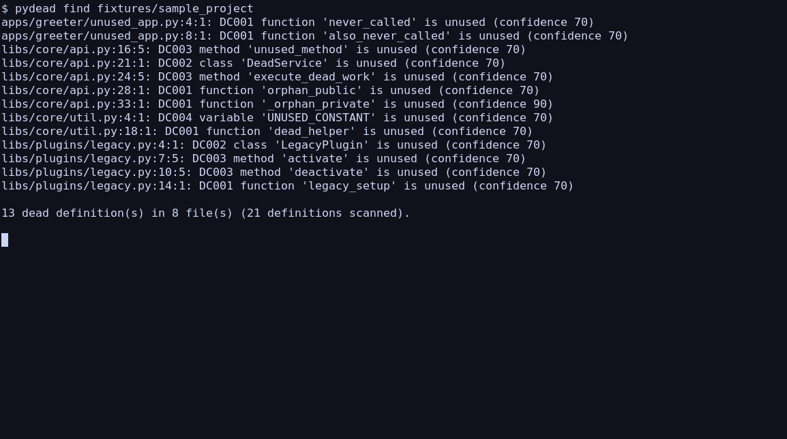
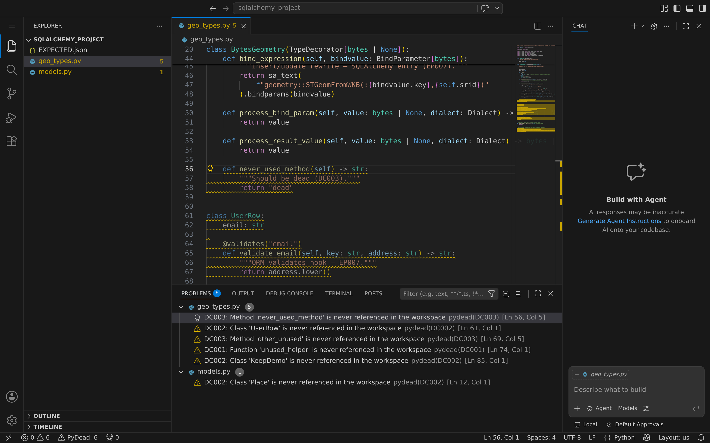
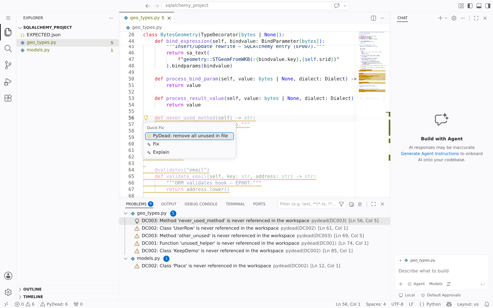

# PyDead

<p align="center">
  
</p>

<p align="center">
  <a href="https://marketplace.visualstudio.com/items?itemName=pydead.pydead"></a>
  <a href="https://github.com/ErikbStorm/pydead/releases/latest"></a>
  <a href="LICENSE"></a>
</p>

<p align="center">
  <strong><a href="https://marketplace.visualstudio.com/items?itemName=pydead.pydead">Install on VS Code Marketplace →</a></strong>
  ·
  <a href="https://github.com/ErikbStorm/pydead/releases/latest">GitHub Releases</a>
</p>

**Cross-file dead code finder for Python**, written in Rust — with a VS Code extension that highlights unused definitions in the folder you open.

Unlike Ruff/pyflakes (file-local), PyDead analyzes an entire workspace tree so it can see when packages import each other across a monorepo.

<p align="center">
  
</p>

<p align="center">
  
</p>

<p align="center">
  
</p>

> **Real screenshots** (not mockups): CLI is a **true XTerm window capture** (Xvfb + real `pydead` binary); editor is **headless code-server + Playwright** — all in Docker so your personal VS Code is never opened.  
> Regenerate: `./scripts/screenshots/run-docker.sh` — see [`scripts/screenshots/README.md`](scripts/screenshots/README.md).

## What it finds

- Unused **functions**
- Unused **classes**
- Unused **methods**
- Unused **module-level variables**

Scope = the folder you pass to the CLI (or the VS Code workspace root).

### CLI

```bash
pydead find .
# path:line:col: DC001 function 'orphan' is unused (confidence 70)
```

### VS Code

Unused definitions are underlined; the status bar shows **PyDead: N**.

**Quick Fix** (`⌘.` / `Ctrl+.`) — two options only:

- **Keep** → insert `# pydead: keep`
- **Remove** → delete this definition

Other actions live in the **Command Palette** / right-click menu: report false positive, keep (rule code only), fix all in file/workspace.

## Install

### VS Code / Cursor (recommended)

**→ [PyDead on the VS Code Marketplace](https://marketplace.visualstudio.com/items?itemName=pydead.pydead)**

The extension **bundles the `pydead` binary** for your OS — no separate CLI install needed.

| Method | How |
|--------|-----|
| **Marketplace** | [Open listing](https://marketplace.visualstudio.com/items?itemName=pydead.pydead) → **Install** |
| **In editor** | Extensions (`⌘⇧X` / `Ctrl+Shift+X`) → search **PyDead** → Install |
| **CLI** | `code --install-extension pydead.pydead` |
| **VSIX** (offline / Cursor) | [Download from Releases](https://github.com/ErikbStorm/pydead/releases/latest) → Extensions → ⋯ → **Install from VSIX…** |

After install: reload, open a Python folder, run **PyDead: Find Dead Code** (`⌘⇧P` / `Ctrl+Shift+P`).  
Status bar shows **PyDead: N**; Problems lists findings like `DC001`.

### CLI (no Rust required)

```bash
curl -fsSL https://raw.githubusercontent.com/ErikbStorm/pydead/main/scripts/install.sh | bash
# installs to ~/.local/bin/pydead — ensure that dir is on your PATH
# verifies SHA-256 against the release SHA256SUMS file (when present)
pydead find .
```

Or download a platform archive from [GitHub Releases](https://github.com/ErikbStorm/pydead/releases), check it against `SHA256SUMS`, and put `pydead` on your `PATH`.

### From source (developers)

```bash
cargo install --git https://github.com/ErikbStorm/pydead --locked pydead
# or, from a clone:
cargo install --path crates/pydead
```

## Development checks (pre-commit)

Same gates as GitHub Actions (fmt, clippy `-D warnings`, tests). Enable once per clone:

```bash
./scripts/install-hooks.sh
```

| Command | What it does |
|---------|----------------|
| `./scripts/check.sh` | fmt check + clippy + tests + extension compile |
| `FIX_FMT=1 ./scripts/check.sh` | run `cargo fmt` then the rest |
| `SKIP_TESTS=1 ./scripts/check.sh` | skip tests (faster) |
| `SKIP_EXTENSION=1 ./scripts/check.sh` | skip VS Code TypeScript compile |
| `SKIP_HOOKS=1 git commit …` | bypass pre-commit entirely |

The pre-commit hook runs `scripts/check.sh` automatically (extension compile only if `vscode-extension/` sources are staged; docs-only commits skip cargo).

## Usage

```bash
# Find dead code (human-readable)
pydead find path/to/project

# JSON (used by the VS Code extension)
pydead find path/to/project --format json

# SARIF for CI
pydead find path/to/project --format sarif

# Preview removals
pydead fix path/to/project --dry-run

# Apply all fixable findings
pydead fix path/to/project --yes
```

### Options

| Flag | Description |
|------|-------------|
| `--min-confidence <0-100>` | Default `70`. Private (`_name`) findings are confidence `90`; public are `70`. |
| `--config <path>` | `pydead.toml` or `pyproject.toml` with `[tool.pydead]` |
| `--ids id1,id2` | Fix only selected findings (ids from JSON) |

### Config (`pydead.toml` or `[tool.pydead]` in `pyproject.toml`)

```toml
[tool.pydead]
min_confidence = 70
exclude = ["**/migrations/**"]
ignore_names = ["visit_*"]
keep_public = false
```

## How analysis works

1. Discover all `*.py` under the root (respects `.gitignore`; skips venvs/caches).
2. Parse with `rustpython-parser`.
3. Collect definitions and name uses (including imports and attributes).
4. **Iterative liveness**: module-level uses seed the live set; uses inside live functions/classes mark more names live until fixpoint. Symbols only referenced from dead code are dead.
5. Always-live via **rule codes** (EP family): dunders, tests, `__all__`, Azure, Alembic, Pydantic, **SQLAlchemy TypeDecorator/ORM hooks**, plus user config.
6. Findings use **DC** codes (`DC001` unused function, …) — Ruff-style; config `ignore` or **inline `# noqa: DC003` / `# pydead: ignore`**.

### Rule catalog

See **[docs/rules.md](docs/rules.md)** for every code, Alembic/Azure details, and how to add your own entry points.

```bash
pydead rules                 # list EP* / DC* codes
```

```toml
[tool.pydead]
ignore = []                  # e.g. ["DC004", "EP005"]
entry_names = ["main"]       # EP010
entry_decorators = ["task"]  # EP011

[[tool.pydead.entry_rules]]  # EP012 — path-scoped, custom code
code = "EP100"
names = ["handle"]
paths = ["**/handlers/*.py"]
```

### Fixtures

```bash
cargo test -p pydead --test azure_functions_v2
cargo test -p pydead --test alembic_project
cargo test -p pydead --test pydantic_project
cargo test -p pydead --test sqlalchemy_project
pydead find fixtures/azure_functions_v2
pydead find fixtures/alembic_project
pydead find fixtures/pydantic_project
pydead find fixtures/sqlalchemy_project
```

### Mark code as intentionally kept (not unused)

```python
def leftover_for_plugins():  # pydead: keep
    ...

def weird_hook(self):  # pydead: keep DC003
    ...

# pydead: keep
@app.task
def also_ok():
    ...

# Ruff-compatible
def ruff_style():  # noqa: DC001
    ...
```

See [docs/rules.md](docs/rules.md) for all forms.

### Limitations (honest)

- Dynamic calls (`getattr`, string imports, plugins) can produce false positives.
- Name-based matching: two different functions named `helper` share a name — using one keeps both live.
- Locals inside functions are out of scope (use Ruff).
- After `fix`, run Ruff to clean leftover unused imports.

## Integration fixture

`fixtures/sample_project/` is a multi-package monorepo with intentional live/dead symbols and `EXPECTED.json` ground truth.

```bash
cargo test -p pydead
cargo run -p pydead -- find fixtures/sample_project
```

## VS Code extension

See [`vscode-extension/README.md`](vscode-extension/README.md). Publishing: [`docs/publishing.md`](docs/publishing.md).

## Project layout

```
crates/pydead/          # Rust library + CLI
vscode-extension/       # TypeScript VS Code extension
fixtures/sample_project # Ground-truth monorepo for tests
```

## License

This repository is licensed under the **[MIT License](LICENSE)** (shown on GitHub as MIT).

Logo and icon artwork are **[CC BY 4.0](docs/images/LICENSE)** (see that file for attribution).
